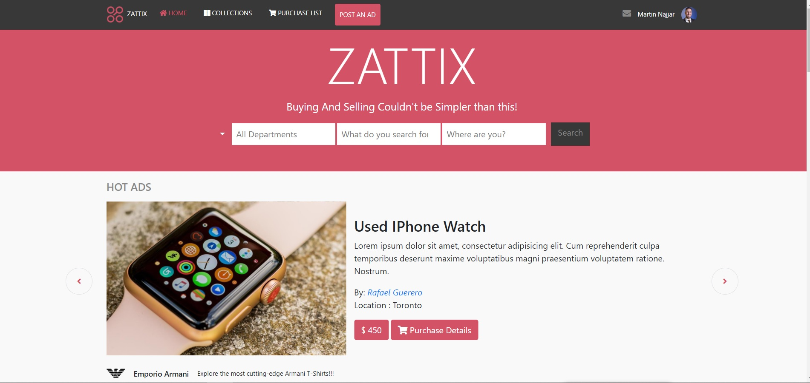

# Zattix Fashion Store

> Built responsive via Bootstrap

## Built With

- HTML5
- CSS3
- Bootstrap
- Javascript

## Features

- Multi-item Bootstrap Carousel
- Simple Javascript Carousel
- Dropdown menus
- 2 pages site (Click the search button in order to take you to the other page)
- Fully responsive

## Live Demo

[Live Demo Link](https://martinnajjar12.github.io/zattix-fashion-store/)

## Authors

👤 **Martin Najjar**

- Github: [@githubhandle](https://github.com/martinnajjar12)
- Twitter: [@twitterhandle](https://twitter.com/martin_najjar)
- Linkedin: [linkedin](https://www.linkedin.com/in/martinnajjar12/)

## 🤝 Contributing

Contributions, issues and feature requests are welcome!

Feel free to check the [issues page](https://github.com/martinnajjar12/zattix-fashion-store/issues).

## Show your support

Give a ⭐️ if you like this project!

## Acknowledgments

- [Implementing Mohammed Awad design using Bootstrap](https://www.behance.net/gallery/24796463/ZATTIX)

## 📝 License

This project is [MIT](https://github.com/martinnajjar12/zattix-fashion-store/blob/master/LICENSE) licensed.
